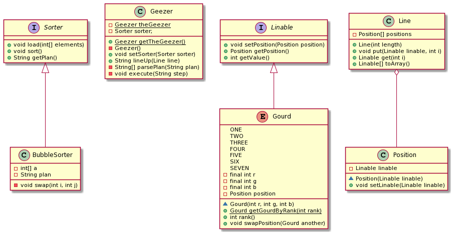
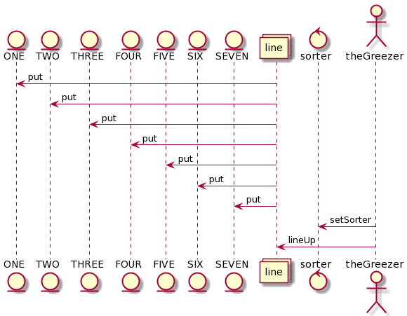

## 任务一

### 类图与时序图

### 设计思路
#### 模拟现实 抽象出Position
如果按照学习算法时的编程思路，我们会将元素保存在数组中，而排序是通过数组交换两个下标上的元素来实现。此时交换的过程中，数组是主动的一方，元素是被动的一方。数组控制着个元素的顺序，而各元素对自身的位置并不知情，也无法改变。

而现实中脚是长在人身上的，我们想要交换两个同学的位置是通知学生去交换，而不是通知大地去交换。

#### 将Sorter与Greezer分离
排队是`Greezer`的功能之一，但是在`Greezer`里面排序策略交给`Sorter`去产生，而实际的排序操作自己去完成。

一方面，把排序策略分离出去可以提高可拓展性，可以更方便地采用不同的排序策略。另一方面，不让`Sorter`直接操作元素进行排序，可以提高安全性，和操作系统中“策略与机制分离”如出一辙。

### 改进
#### Position没有坐标信息
`Position`仅仅作为`Line`的组成部分而存在，而没有当前位置信息。这样的话每个元素依然不知道自己当前位置。
#### Sorter与Greezer通过字符串交互效率低
Sorter的排序策略是通过字符串表示，解析之后才让Greezer执行。可以统一一个接口来交互这些信息。
另外，排序策略中的信息是每次交换元素的rank（或者value），然后Greeze再根据rank查找相应元素，在进行交换。如果排序策略中的信息是每次交换的位置，Greeze可以直接通过位置得到相应元素，效率提高。
#### Line的toString()效率低
Line.toString()通过频繁对String采用拼接操作，而对字符串操作应该使用StringBuilder。

